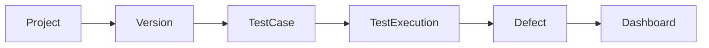
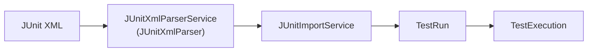
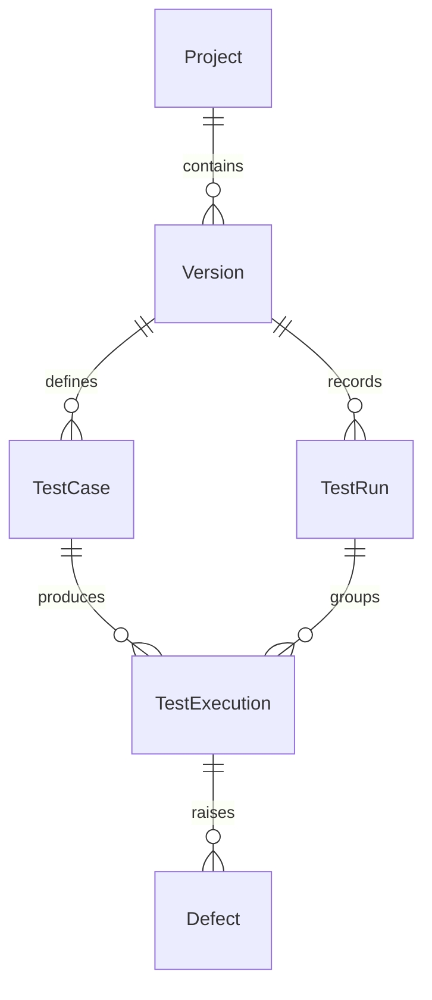
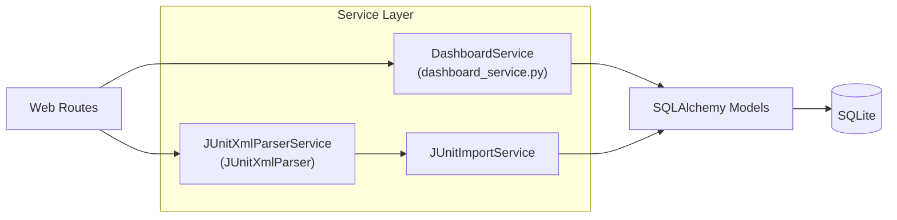
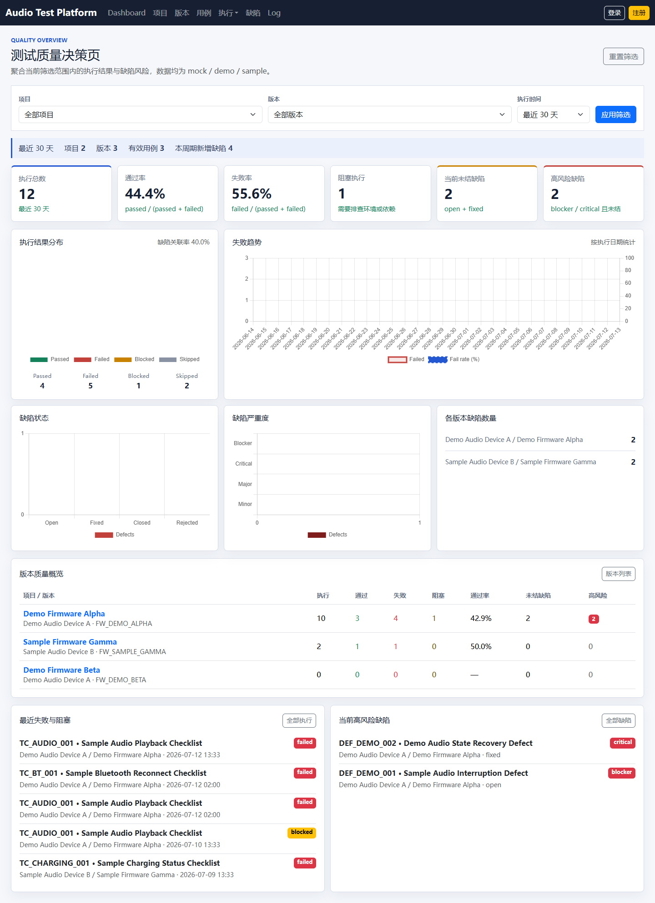
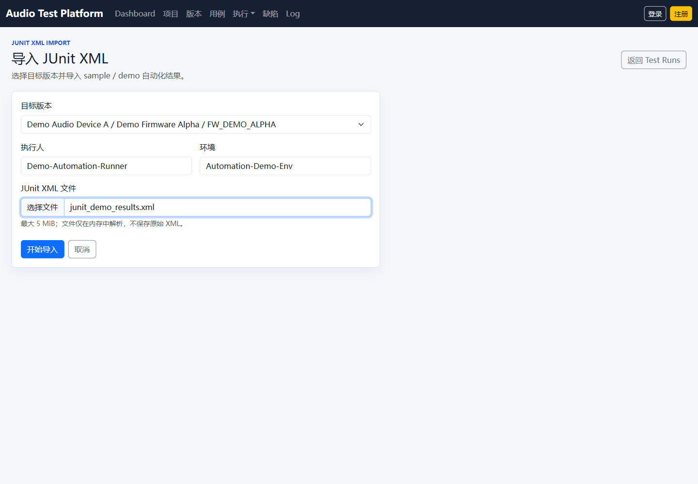
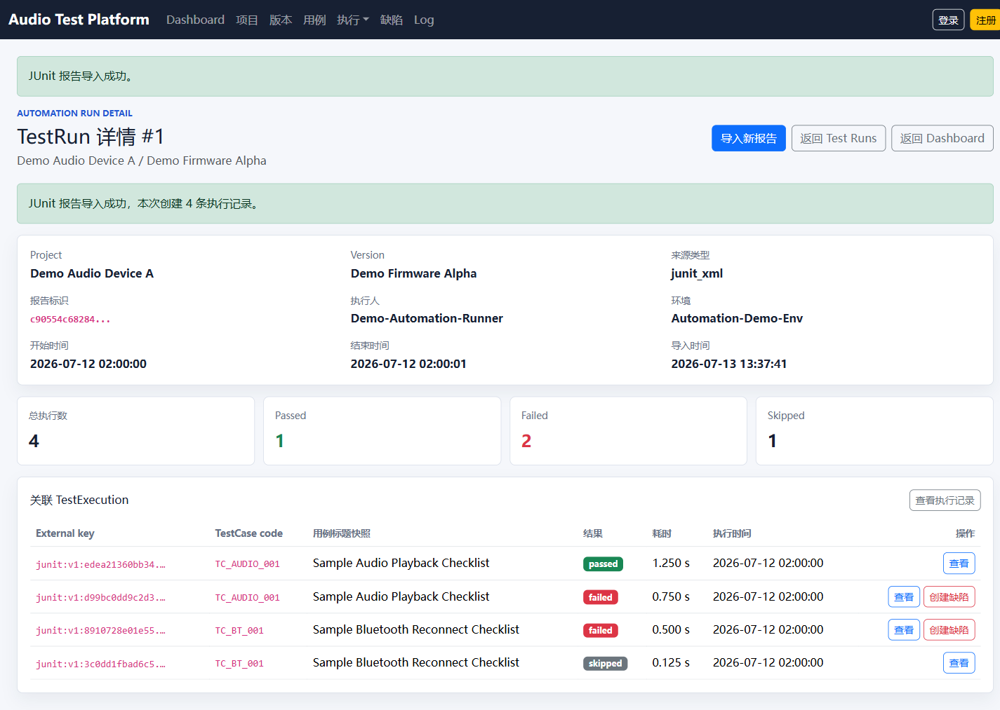
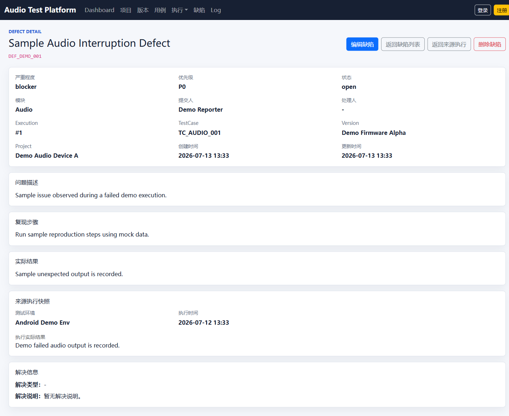

# audio-test-management-platform

[](https://github.com/hzyufu-del/audio-test-management-platform/actions/workflows/ci.yml?query=branch%3Amaster)

中文名：消费电子音频产品测试管理与自动化辅助平台

面向消费电子音频产品测试场景的测试管理与自动化辅助平台模拟项目。

## 项目定位

项目根据测试流程进行抽象，覆盖 Project、Version、TestCase、TestExecution、Defect、TestRun 和 Dashboard。它用于求职作品展示，不是任何公司内部系统的复刻。

> 数据边界：仓库和页面只使用 mock / demo / sample 数据，不包含真实公司、项目、版本、测试用例、缺陷、Log、账号凭据或内部截图。

## 质量状态

| 检查项 | 当前结果 |
| --- | --- |
| Tests | 192 passed |
| Coverage | 90.72% |
| Coverage gate | 90% |
| Ruff | passed |
| GitHub Actions | passed |
| Migration check | passed |
| Python CI | 3.12 |

## 业务流程

### 手工测试闭环



### 自动化结果导入



`JUnitXmlParserService` 是图中的架构角色；代码中的实际实现类名为 `JUnitXmlParser`。

## 数据模型



模型通过现有外键建立关系：TestCase 只保存 `version_id`，TestExecution 只保存 `test_case_id` 和可选的 `test_run_id`，没有重复保存 Project 或 Version 外键。

## 架构



- Parser 不依赖 Flask 和数据库，输入 bytes，输出标准化且不可变的解析结果；`defusedxml` 禁止 DTD、实体和外部引用。
- Import Service 按目标 Version 严格匹配 TestCase code，以 SHA-256 报告摘要实现幂等，并在单事务中写入 TestRun 与 TestExecution；约束或数据库错误会触发整批回滚。
- Dashboard Service 对数据库中的 Project、Version、TestExecution 和 Defect 做聚合，生成指标、趋势、版本质量和关注项。

## 项目亮点

- 测试项目、版本、用例、执行、缺陷形成完整闭环。
- TestExecution 保存 TestCase 历史快照，Defect 保存失败执行快照，后续修改主数据不会覆盖历史内容。
- SQLite 启用外键约束，并通过组合唯一约束保护 Version、TestCase、TestRun 和自动化执行记录。
- Flask-Migrate 管理 upgrade / downgrade，CI 会从空数据库升级到 migration head 并执行模型漂移检查。
- Defect 只能从 failed TestExecution 创建。
- Dashboard 由数据库聚合结果驱动，不依赖硬编码统计值。
- JUnit XML 使用安全解析和 XXE 防护，并限制文件大小、用例数量、嵌套深度和属性长度。
- TestRun 记录一次自动化运行批次，并关联本批次导入的 TestExecution。
- 导入前严格匹配目标 Version 下的 TestCase code，匹配失败时不写入部分数据。
- 以 SHA-256 报告摘要识别重复导入。
- TestRun 与 TestExecution 在单事务中写入，失败时整批 rollback。
- 当前测试基线为 192 个 pytest，coverage 90.72%。
- Ruff 和 GitHub Actions 检查依赖、编译、迁移、模型一致性、测试与 coverage 门槛。

## 页面截图

截图由本地 `init-db` 生成的 mock / demo / sample 数据和公开的 JUnit 示例文件产生。

### Dashboard



### JUnit XML 导入



### TestRun 详情



### Defect 详情



## 快速启动

以下命令以 Windows PowerShell 为例：

```powershell
python -m venv .venv
.\.venv\Scripts\Activate.ps1
python -m pip install -r requirements-dev.txt

Copy-Item .env.example .env

flask --app run.py db upgrade
flask --app run.py init-db
flask --app run.py run
```

`.env.example` 使用本地 sample 配置：

```dotenv
FLASK_APP=run.py
FLASK_DEBUG=1
SECRET_KEY=sample-local-dev-secret-key
DATABASE_URI=sqlite:///instance/audio_test_platform.sqlite
```

浏览器访问 `http://127.0.0.1:5000`。

### 测试、Ruff 与 coverage

```powershell
python -m pytest
python -m ruff check .
python -m pytest --cov=app --cov-report=term-missing --cov-report=xml --cov-fail-under=90
```

### 数据库迁移检查

```powershell
flask --app run.py db current
flask --app run.py db check
```

## JUnit 演示流程

演示文件：[`docs/samples/junit_demo_results.xml`](docs/samples/junit_demo_results.xml)。

1. 执行 `flask --app run.py db upgrade` 和 `flask --app run.py init-db` 初始化 demo 数据。
2. 启动应用，打开导航栏中的 Test Runs。
3. 进入“导入 JUnit XML”，选择与示例用例编码匹配的 `Demo Firmware Alpha`。
4. 上传 `docs/samples/junit_demo_results.xml`。
5. 查看新建的 TestRun 及其 TestExecution 明细。
6. 返回 Dashboard，确认执行统计和版本质量数据已更新。

## 目录说明

```text
app/
├── blueprints/             # Web Routes
├── services/
│   ├── dashboard_service.py
│   ├── junit_import_service.py
│   └── junit_xml_parser.py
├── templates/
├── static/
└── models.py
docs/
├── images/                 # 仅存放 mock/demo 页面截图
└── samples/
    └── junit_demo_results.xml
migrations/                 # Flask-Migrate 迁移
tests/                      # pytest 测试
```

技术栈：Python 3.12、Flask、Flask-SQLAlchemy、Flask-Migrate、SQLite、Bootstrap 5、Chart.js、pytest、pytest-cov、Ruff、GitHub Actions。
