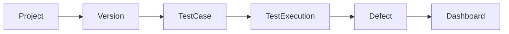
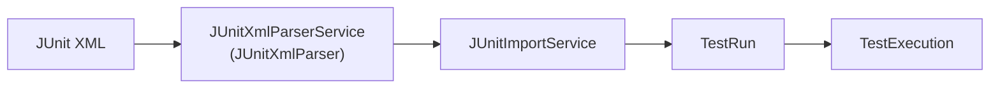
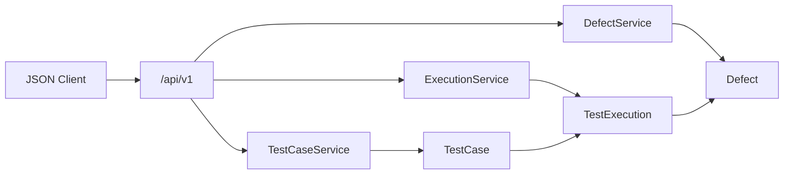
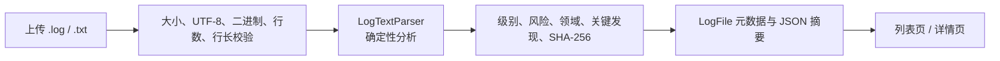
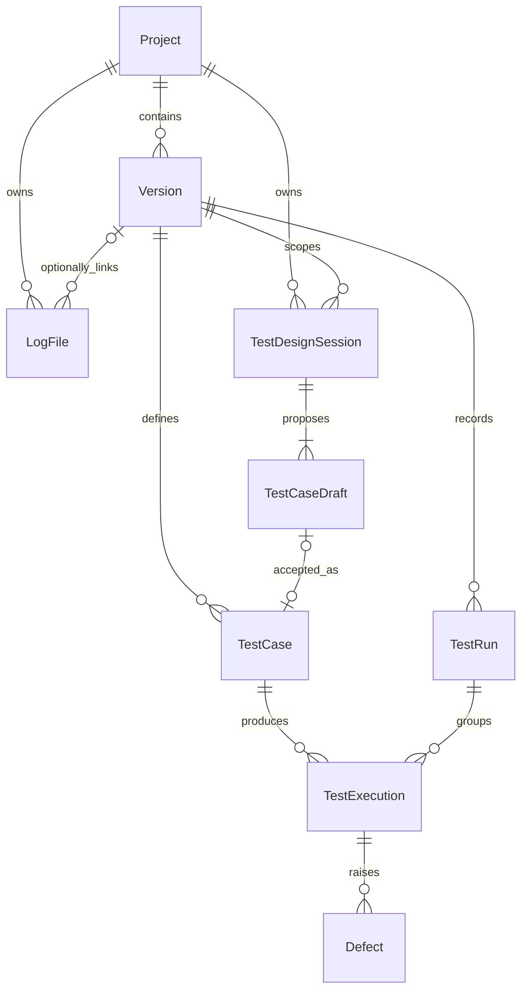
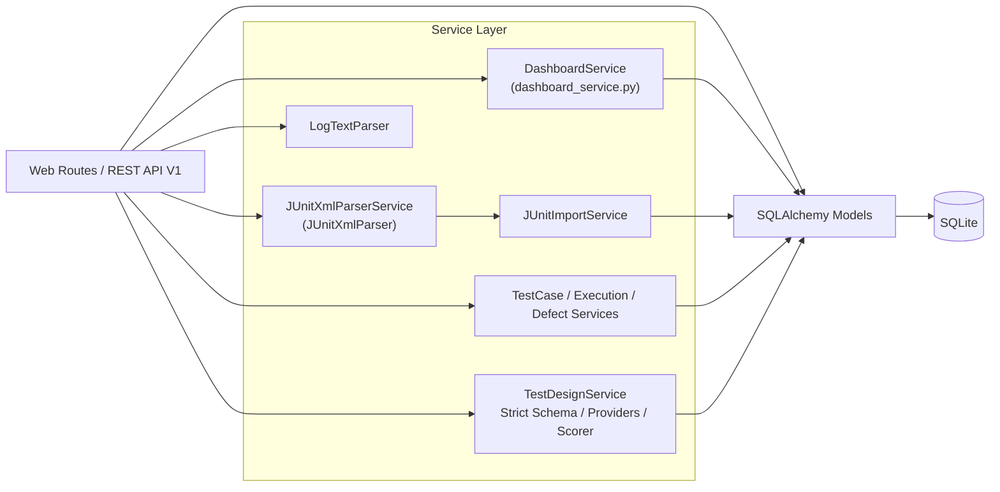

# audio-test-management-platform

[](https://github.com/hzyufu-del/audio-test-management-platform/actions/workflows/ci.yml?query=branch%3Amaster)

中文名：消费电子音频产品测试管理与自动化辅助平台

面向消费电子音频产品测试场景的测试管理与自动化辅助平台模拟项目。

## 项目定位

项目根据测试流程进行抽象，覆盖 Project、Version、TestCase、TestExecution、Defect、TestRun、Log Analysis、REST API V1 和 Dashboard。它用于求职作品展示，不是任何公司内部系统的复刻。

> 数据边界：仓库和页面只使用 mock / demo / sample 数据，不包含真实公司、项目、版本、测试用例、缺陷、Log、账号凭据或内部截图。

## 质量状态

| 检查项 | 当前结果 |
| --- | --- |
| Tests (local) | 622 passed |
| Coverage (local) | 94.01% |
| Coverage gate | 90% |
| Ruff (local) | passed |
| GitHub Actions | Python 3.12 quality checks passed; Docker not included |
| Migration check (local) | passed (`c5d8a9e4f2b1` head) |
| Python CI | 3.12 |

## 业务流程

### 手工测试闭环



### 自动化结果导入



`JUnitXmlParserService` 是图中的架构角色；代码中的实际实现类名为 `JUnitXmlParser`。

### REST API V1



- 提供 health、TestCase、TestExecution 和 Defect 的 JSON 查询/写入接口。
- POST / PATCH 只接受 `application/json`，通过 Pydantic v2 拒绝未知字段和 Mass Assignment。
- 统一返回 400 / 404 / 409 / 415 / 422 / 500 错误结构，不暴露 traceback、SQL 或数据库路径。
- 手工 Execution 和 Defect 复用现有快照 helper；数据库写入失败会 rollback。
- 完整接口、curl 和 PowerShell 示例见 [`docs/api/rest_api_v1.md`](docs/api/rest_api_v1.md)。

### Log Analysis V1



1. 上传时必须选择 Project；Version 可选，但选择后必须属于该 Project。
2. `LogTextParser` 只接收内存中的 bytes，不依赖 Flask、SQLAlchemy 或 AI Provider。
3. 解析器按大小写无关的固定规则统计 critical / error / warning / info，并识别 connection / power / battery / audio / protocol。
4. 风险等级依次为 critical、high、medium、low；关键发现保留行号和安全截断片段。
5. 同一 Project 下使用 `(project_id, sha256)` 唯一约束阻止重复分析；数据库失败时 rollback。
6. 数据库只保存文件名、大小、SHA-256、统计结果和有上限的 JSON 摘要，不保存上传文件或完整日志正文。

#### Log 安全边界

- 只接受 `.log` / `.txt`，文件名经 `secure_filename` 规范化。
- 文件上限为 2 MiB、20,000 行、单行 8,192 字符；只接受 UTF-8 / UTF-8 BOM，并拒绝明显二进制内容。
- 原始日志不落盘、不写入数据库，也没有原始文件下载路由。
- JSON 摘要最多保存 50 条关键发现，每条片段最多 240 字符；页面使用 Jinja 自动转义，不使用 `|safe`。
- demo seed 仅在内存中分析 mock / demo / sample 文本，持久化后不保留样本文本或本地绝对路径。
- Log Analysis V1 不调用 AI，不新增 ADB、串口、压缩包、异步任务或外部检索服务。

#### 主要测试场景

- 正常分析、大小写无关关键字、四档风险、多领域命中、稳定 SHA-256 和 JSON 可序列化。
- 空文件、超大文件、非 UTF-8、明显二进制、超行数、超行长、扩展名与文件名安全。
- Project / Version 缺失、不存在或跨 Project，重复日志、数据库失败 rollback 和详情 404。
- 模型字段/可空性/外键/唯一约束，migration upgrade / downgrade / re-upgrade 与 `flask db check`。
- 关键片段截断、HTML 自动转义、原始正文不入库，以及 `init-db` 重复执行幂等。

## 数据模型



模型通过外键建立关系：TestCase 只保存 `version_id`，TestExecution 只保存 `test_case_id` 和可选的 `test_run_id`；LogFile 保存必填 `project_id` 和可选 `version_id`，不保存原始日志正文或本地文件路径。

## 架构



- Parser 不依赖 Flask 和数据库，输入 bytes，输出标准化且不可变的解析结果；`defusedxml` 禁止 DTD、实体和外部引用。
- Import Service 按目标 Version 严格匹配 TestCase code，以 SHA-256 报告摘要实现幂等，并在单事务中写入 TestRun 与 TestExecution；约束或数据库错误会触发整批回滚。
- Dashboard Service 对数据库中的 Project、Version、TestExecution 和 Defect 做聚合，生成指标、趋势、版本质量和关注项。
- LogTextParser 执行同步、有边界、可重复的纯文本分析；路由只负责 Project / Version 校验和数据库事务。
- REST API 路由负责 HTTP/JSON 边界，Pydantic Schema 负责字段校验，Workflow Service 负责查询、业务约束和事务。

AI Test Design separates strict schemas, offline/external Providers,
deterministic local scoring, and the atomic human-acceptance workflow from
the existing TestCase review assistant.

## 项目亮点

- 测试项目、版本、用例、执行、缺陷形成完整闭环。
- TestExecution 保存 TestCase 历史快照，Defect 保存失败执行快照，后续修改主数据不会覆盖历史内容。
- SQLite 启用外键约束，并通过组合唯一约束保护 Version、TestCase、TestRun 和自动化执行记录。
- Flask-Migrate 管理 upgrade / downgrade，CI 会从空数据库升级到 migration head 并执行模型漂移检查。
- Defect 只能从 failed TestExecution 创建。
- Dashboard 由数据库聚合结果驱动，不依赖硬编码统计值。
- JUnit XML 使用安全解析和 XXE 防护，并限制文件大小、用例数量、嵌套深度和属性长度。
- TestRun 记录一次自动化运行批次，并关联本批次导入的 TestExecution。
- 导入前严格匹配目标 Version 下的 TestCase code，匹配失败时不写入部分数据。
- 以 SHA-256 报告摘要识别重复导入。
- TestRun 与 TestExecution 在单事务中写入，失败时整批 rollback。
- Log Analysis V1 不保存上传文件，以 SHA-256、确定性统计和有上限的安全摘要支持复核。
- REST API V1 提供严格分页、筛选、状态码、Location、快照和安全回滚测试，不实现不完整的 JWT 或 RBAC。
- 当前本地测试基线为 622 个 pytest，coverage 94.01%。
- Ruff 和 GitHub Actions 检查依赖、编译、迁移、模型一致性、测试与 coverage 门槛。

## 页面截图

截图由本地 `init-db` 生成的 mock / demo / sample 数据和公开的 JUnit 示例文件产生。

### Dashboard


### JUnit XML 导入


### TestRun 详情


### Defect 详情


## Optional AI TestCase Review Assistant

AI 用例质量审查是 TestCase 详情页上的可选旁路能力，只审查已有用例，不生成、修改或自动保存测试用例。处理顺序为：确定性规则检查、可插拔语义审查、Pydantic v2 严格结构校验、启发式评分和页面展示。

- 默认 `AI_ENABLED=false`，不会调用任何 AI Provider。
- 默认 Provider 为完全离线且确定性的 `mock`，页面标记为 Demo AI Review。
- 可选 Provider 为 `deepseek`，使用 OpenAI-compatible API；模型名称必须通过本地环境变量配置，业务代码不写死模型。
- `DEEPSEEK_THINKING_ENABLED=false` 默认关闭 Thinking Mode，以适配低延迟、严格 JSON 结构的 TestCase 审查；需要时可通过本地配置显式启用。
- Provider 只接收 TestCase、Version 和 Project 的字段白名单，不接收数据库 ID、用户数据、凭据、日志、JUnit 原文或本地路径。
- DeepSeek JSON 输出仍需通过 Pydantic 严格校验；额外字段、非法 JSON 和不完整 Schema 会被拒绝。
- TestCase 文本始终被视为待分析数据，不能改变 System Prompt、输出 Schema 或应用评分。
- AI 结果不会写回数据库，刷新页面后消失；规则与 AI 结果不能替代需求确认、测试设计评审或人工判断。
- API Key 只从本地环境变量加载，`.env.example` 保持空值；CI 不配置 Key，也不访问外部 AI 服务。
- 所有演示内容仅使用 mock / demo / sample 数据。
- 非法 AI 配置会安全禁用可选审查能力，不会阻止平台核心功能启动或访问。

本地配置项见 [`.env.example`](.env.example)。启用 DeepSeek 前，应在被 Git 忽略的本地 `.env` 中设置 `AI_ENABLED`、`AI_PROVIDER`、`DEEPSEEK_API_KEY` 和 `DEEPSEEK_MODEL`，不要把 `.env` 或任何真实凭据提交到仓库。

## AI Test Design Assistant

The human-reviewed AI Test Design workflow generates structured test points
and editable TestCase drafts from mock/demo/sample requirements. Drafts never
become formal TestCases until a tester explicitly accepts them; generation,
quality scoring, prompt-injection warnings, acceptance, rejection, and rollback
remain deterministic and testable with the offline Mock Provider.

See [AI Test Design Assistant V1](docs/ai/test_design_assistant.md) for the
Provider architecture, strict schema, local scoring rules, data boundary,
human-review transaction, demo flow, and limitations.

## 快速启动

以下命令以 Windows PowerShell 为例：

```powershell
python -m venv .venv
.\.venv\Scripts\Activate.ps1
python -m pip install -r requirements-dev.txt

Copy-Item .env.example .env

flask --app run.py db upgrade
flask --app run.py init-db
flask --app run.py run
```

`.env.example` 使用本地 demo 配置：

```dotenv
FLASK_APP=run.py
FLASK_DEBUG=1
SECRET_KEY=replace-with-local-secret
DATABASE_URI=sqlite:///instance/audio_test_platform.sqlite
```

`SECRET_KEY` 只是本地占位值，复制为 `.env` 后应替换；不要用于公网或生产环境。

浏览器访问 `http://127.0.0.1:5000`。

## Docker 快速启动

Docker 配置面向本地 demo 和作品展示。首次运行：

```powershell
Copy-Item .env.example .env
docker compose up --build
```

Compose 默认将服务绑定到 `127.0.0.1:5000`，只允许本机访问。

启动入口会先执行 migration upgrade，再根据 `SEED_DEMO_DATA` 决定是否初始化 demo 数据。`.env.example` 默认设置为 `true`，现有 `init-db` 可以重复执行，不会重复插入同一批 seed 记录。

浏览器访问：

```text
http://127.0.0.1:5000
```

健康检查：

```text
http://127.0.0.1:5000/api/v1/health
```

停止容器并删除本地 demo volume：

```powershell
docker compose down -v
```

Compose 会把容器数据库固定到 `/app/instance/audio_test_platform.sqlite`，并挂载 named volume。`.env.example` 中的 `sqlite:///instance/audio_test_platform.sqlite` 供本机 Flask 启动使用，Compose 会显式覆盖为容器内绝对路径。

容器使用 Gunicorn，由非 root 用户运行。默认 `AI_ENABLED=false`、`AI_PROVIDER=mock`，不会调用外部 AI Provider。

## API 演示

先确认应用已运行且执行过 `init-db`。Python 脚本只使用标准库，通过 HTTP 完成 TestCase → failed TestExecution → Defect → fixed Defect 闭环：

```powershell
python scripts/api_smoke.py
```

Windows PowerShell 版本：

```powershell
powershell -ExecutionPolicy Bypass -File scripts/api_smoke.ps1 `
  -BaseUrl http://127.0.0.1:5000 `
  -TimeoutSec 15
```

Python 脚本支持自定义地址和超时：

```powershell
python scripts/api_smoke.py --base-url http://127.0.0.1:5000 --timeout 5
```

两个脚本每次生成唯一的 mock code，不直接访问数据库。PowerShell 脚本会读取真实 HTTP 状态码，验证 GET/PATCH 的 200、创建请求的 201、错误示例的 415/422/409，并检查创建响应的 `Location` Header。任一步失败都会返回非零退出码，并隐藏 traceback、数据库路径和敏感配置。

## Postman

导入：

```text
docs/api/audio_test_platform_rest_api_v1.postman_collection.json
```

Collection 使用 v2.1 格式。运行前设置：

```text
base_url=http://127.0.0.1:5000
```

按 Collection 顺序执行即可。`List TestCases` 从 seed 数据取得 `version_id`，后续请求会自动保存 `test_case_id`、`execution_id` 和 `defect_id`。Collection 还包含 415、422 和 409 示例。

## 交付安全边界

- Docker 配置只用于本地 demo 和作品展示。
- 当前 API 没有生产级认证，不应直接暴露公网。
- SQLite 适合单机演示，不代表生产环境的并发和高可用方案。
- Log Analysis 不保存上传的原始日志。
- `.env`、API Key、数据库文件和 Docker volume 内容不会提交到仓库。
- 默认关闭外部 AI Provider；mock Provider 不访问网络。

## 推荐演示顺序

1. 打开 Dashboard，说明数据库聚合指标。
2. 导入 sample JUnit XML，查看 TestRun 与执行快照。
3. 上传 mock Log，查看确定性风险和关键发现。
4. 在 TestCase 详情页运行旁路 AI Review。
5. 执行 REST API smoke 脚本。
6. 导入 Postman Collection，演示成功与错误响应。

完整讲解材料见 [`docs/portfolio/project_walkthrough.md`](docs/portfolio/project_walkthrough.md)。

### 测试、Ruff 与 coverage

```powershell
python -m pytest
python -m ruff check .
python -m pytest --cov=app --cov-report=term-missing --cov-report=xml --cov-fail-under=90
```

REST API V1 的 pytest 覆盖 health、统一错误、分页、筛选、创建、快照、状态冲突和数据库 rollback。接口文档见 [`docs/api/rest_api_v1.md`](docs/api/rest_api_v1.md)。

#### pytest 自动验证

- Dockerfile、Compose 回环地址绑定、entrypoint 和 `.dockerignore` 静态规则
- Postman JSON 结构和敏感字段边界
- Python smoke 的模拟 HTTP 正常闭环、服务不可用、非 JSON、超时和 409
- PowerShell smoke 的真实状态码、超时、错误状态和 `Location` 检查逻辑
- 本机存在 PowerShell 时，自动执行 AST 解析及本地 HTTP stub 闭环

#### 本地人工实际验证

- `docker compose build`、`docker compose up` 和 healthcheck
- 容器非 root 用户及 `127.0.0.1:5000` HostIp
- Python 与 PowerShell 真实 HTTP smoke
- 服务不可用时 PowerShell 的超时和非零退出
- 验收后的 `docker compose down -v`

PR 的 GitHub Actions 在 Python 3.12 环境检查依赖、编译、Ruff、迁移、pytest 和 coverage；当前工作流不执行 Docker build。

### 数据库迁移检查

```powershell
flask --app run.py db current
flask --app run.py db check
```

## JUnit 演示流程

演示文件：[`docs/samples/junit_demo_results.xml`](docs/samples/junit_demo_results.xml)。

1. 执行 `flask --app run.py db upgrade` 和 `flask --app run.py init-db` 初始化 demo 数据。
2. 启动应用，打开导航栏中的 Test Runs。
3. 进入“导入 JUnit XML”，选择与示例用例编码匹配的 `Demo Firmware Alpha`。
4. 上传 `docs/samples/junit_demo_results.xml`。
5. 查看新建的 TestRun 及其 TestExecution 明细。
6. 返回 Dashboard，确认执行统计和版本质量数据已更新。

## 目录说明

```text
app/
├── blueprints/             # Web Routes 与 api_v1
├── services/
│   ├── dashboard_service.py
│   ├── testcase_service.py
│   ├── execution_service.py
│   ├── defect_service.py
│   ├── junit_import_service.py
│   ├── junit_xml_parser.py
│   └── log_analysis_service.py
├── templates/
├── static/
└── models.py
docs/
├── api/
│   ├── rest_api_v1.md
│   └── audio_test_platform_rest_api_v1.postman_collection.json
├── images/                 # 仅存放 mock/demo 页面截图
├── portfolio/
│   └── project_walkthrough.md
└── samples/
    └── junit_demo_results.xml
docker/
└── entrypoint.sh
migrations/                 # Flask-Migrate 迁移
scripts/
├── api_smoke.py
└── api_smoke.ps1
tests/                      # pytest 测试
```

技术栈：Python 3.12、Flask、Flask-SQLAlchemy、Flask-Migrate、SQLite、Gunicorn、Docker Compose、Bootstrap 5、Chart.js、pytest、pytest-cov、Ruff、GitHub Actions。
